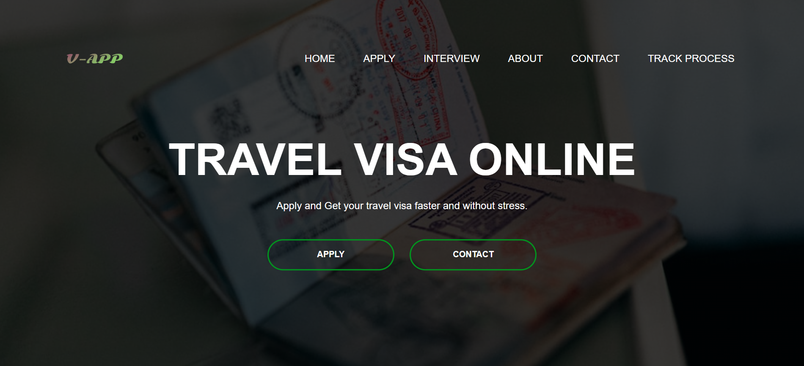

# *TRAVEL VISA ONLINE*

Apply and Get Your Travel Visa Faster And Without Stress.
Emails are sent to applicant after applying and time for their scheduled interview.

# *HOME PAGE VIEW*



# Getting Started

## Installation

1. Clone the repository
    bash 
    ```
        git clone https://github.com/solomonbestz/Visa-App.git
    ```

2. Create Virtual Environment
    bash
    ```
        py -m venv venv
    ```

3. Activate Virtual Environment
    bash
    ```
        ./venv/Scripts/activate
    ```

4. Install Dependencies
    bash
    ```
        pip install -r requirements.txt
    ```

## Usage

1. Create SuperUser
    bash
    ```
        py manage.py createsuperuser
    ```

2. Run Server
    bash 
    ```
        py manage.py runserver
    ```